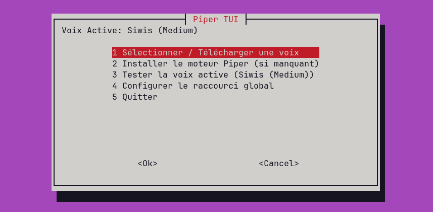

# Piper TUI



Une interface moderne en terminal (TUI) pour gérer [Piper TTS](https://github.com/rhasspy/piper) sous Linux. Ce petit outil permet aux utilisateurs de lire à voix haute n'importe quelle sélection de texte, grâce à un raccourci clavier que vous aurez défini. Vous pouvez lire à voix haute n'importe quelle sélection de texte dans les interfaces de divers applis (navigateur, terminal, IDE, lecteur de documents, suites bureautiques).

## Fonctionnalités
- **Architecture Dual Mode** : 
  - `piper-tui` : L'interface principale, riche et asynchrone (Textual/Python).
  - `piper-tui-lite` : La version bash legacy, propulsée par `whiptail` pour les environnements minimaux.
- Installe et configure automatiquement le moteur Text-to-Speech Piper.
- Parcourez, téléchargez et basculez facilement entre des modèles vocaux français et anglais de haute qualité depuis HuggingFace.
- Génère automatiquement le script `read-selection.sh` pour lire à voix haute le texte sélectionné depuis n'importe quelle application.
- **Contrôleur de lecture flottant** : Widget minimaliste à l'écran permettant de mettre en pause, reprendre ou couper la lecture à tout instant.
- **Gestionnaire de raccourci clavier global** : Configurez, modifiez ou supprimez votre raccourci système directement depuis l'interface (Support GNOME, Cinnamon, MATE, XFCE, KDE, LXQt).

## Prérequis
- `wget`
- `xsel` (pour X11) ou `wl-clipboard` (pour Wayland)
- `alsa-utils` (pour la lecture audio)
- `python3` (pour l'application `piper-tui`)
- `whiptail` (uniquement pour `piper-tui-lite`)

### Spécifications Matérielles
- **CPU** : N'importe quel processeur 64-bits (moteur ONNX ultra-optimisé, tourne de manière fluide même sur des machines modestes).
- **GPU** : **Aucun requis** (Inférence 100% CPU).
- **RAM** : < 100 Mo lors de la lecture active.
- **Stockage** : ~30 Mo pour le moteur + ~15-25 Mo par modèle vocal.

## Installation

Choisissez votre méthode d'installation préférée :

### 1. En une seule ligne (Recommandé)
Exécutez notre script d'installation automatisé :
```bash
curl -sSL https://raw.githubusercontent.com/elkwaet/piper-tui/main/net-install.sh | bash
```
> **Astuce :** Une fois l'installation terminée, redémarrez votre terminal (ou tapez `source ~/.bashrc` / `source ~/.zshrc`), puis lancez `piper-tui`.

### 2. Téléchargement manuel de l'archive (.tar.gz)
Pour les utilisateurs préférant ne pas rediriger directement un script distant dans bash :
```bash
# Télécharger et extraire l'archive
mkdir -p ~/.piper-tui-app && cd ~/.piper-tui-app
curl -sSL https://github.com/elkwaet/piper-tui/archive/refs/heads/main.tar.gz | tar -xz --strip-components=1

# Installer les liens symboliques dans ~/.local/bin
./install.sh
```

### 3. Depuis Git
```bash
# Cloner le dépôt
git clone https://github.com/elkwaet/piper-tui.git
cd piper-tui

# Installer les liens symboliques dans ~/.local/bin
./install.sh
```

## Utilisation

```bash
# Lancer l'interface Python moderne
# (Configure automatiquement un environnement virtuel isolé au 1er lancement)
piper-tui

# Ou lancer la version bash allégée
piper-tui-lite

# Pour désinstaller
./uninstall.sh
```

> **Note :** Pour la configuration manuelle des raccourcis claviers et l'intégration dans les Window Managers (i3, sway, bspwm...), veuillez consulter le [WIKI](WIKI.md) (en anglais).

## Fichiers de configuration

Les paramètres sont sauvegardés dans `~/.config/piper-tui/config.env`.
Les voix téléchargées sont stockées dans `~/.piper/voices/`.

## Remerciements & Crédits
Ce projet repose sur le travail de piliers de l'open-source. Un immense merci à :
- **Michael Hansen & la Open Home Foundation** pour le développement du moteur [Piper TTS](https://github.com/OHF-Voice/piper1-gpl) ultra-rapide.
- **Le projet Rhasspy & la communauté HuggingFace** pour l'entraînement et l'hébergement des remarquables [modèles vocaux ouverts](https://huggingface.co/rhasspy/piper-voices).

## Auteurs
- **elkwaet** - *Développement initial* - [elkwaet](https://gitlab.com/elkwaet)

## Licence
Ce projet est sous  [GNU GPL v3.0](LICENSE).
