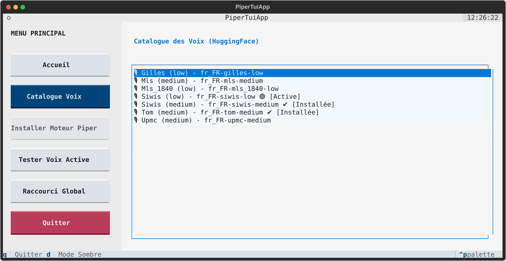

# Piper TUI - Wiki

Welcome to the Piper TUI Wiki!



## Global Keyboard Shortcuts Configuration

For supported Desktop Environments (GNOME, Zorin, Ubuntu, Cinnamon, MATE, XFCE, KDE Plasma, LXQt, Pantheon), the Piper TUI handles the global shortcut configuration automatically via the **Raccourci Global** menu.

### Using the TUI to open System Settings (GUI)

If you prefer using your native system settings (or if you encounter issues with the automatic CLI injection), you can click the **Paramètres GUI** button directly within the modern `piper-tui` interface. This will intelligently detect your desktop environment and pop up your native keyboard settings window (e.g. `gnome-control-center`, `cinnamon-settings`, etc.).

.png)

Additionally, the TUI provides a **Copier la Commande** button which securely copies the required command to your clipboard. You simply need to:
1. Click **Paramètres GUI** (opens the settings window).
2. Click **Copier la Commande**.
3. Create a Custom Shortcut in the GUI and paste the command.
4. Assign your preferred key combination.

Alternatively, for manual setup without the TUI:
1. Open your system **Settings** > **Keyboard** > **Custom Shortcuts**.
2. Add a new shortcut:
   - **Name:** Read Selection (Piper)
   - **Command:** `/home/YOUR_USERNAME/.piper/read-selection.sh` *(replace `YOUR_USERNAME` with your actual Linux username)*
   - **Shortcut:** `Super + Shift + S` (or any combination you prefer)
3. Select any text on your screen (browser, document, terminal) and press your shortcut to hear it!

### Configuration

Settings are saved in `~/.config/piper-tui/config.env`.
Voices are stored in `~/.piper/voices/`.
 

### Window Managers (i3, Sway, Openbox, bspwm)

If you are using a standalone Window Manager (WM), there is no unified CLI standard to inject shortcuts automatically. You must manually add the shortcut to your WM configuration file.

The script to execute is always located at:
`/home/YOUR_USERNAME/.piper/read-selection.sh`

#### i3wm / Sway
Open your config file (`~/.config/i3/config` or `~/.config/sway/config`) and add the following line:
```text
bindsym $mod+Shift+s exec /home/YOUR_USERNAME/.piper/read-selection.sh
```
Reload your configuration:
- i3: `$mod+Shift+c`
- Sway: `$mod+Shift+c`

#### Openbox
Open `~/.config/openbox/rc.xml` and add inside the `<keyboard>` section:
```xml
<keybind key="W-S-s">
  <action name="Execute">
    <command>/home/YOUR_USERNAME/.piper/read-selection.sh</command>
  </action>
</keybind>
```
Reload Openbox: `openbox --reconfigure`

#### bspwm (via sxhkd)
Open `~/.config/sxhkd/sxhkdrc` and add:
```text
super + shift + s
    /home/YOUR_USERNAME/.piper/read-selection.sh
```
Reload sxhkd: `pkill -USR1 -x sxhkd`
